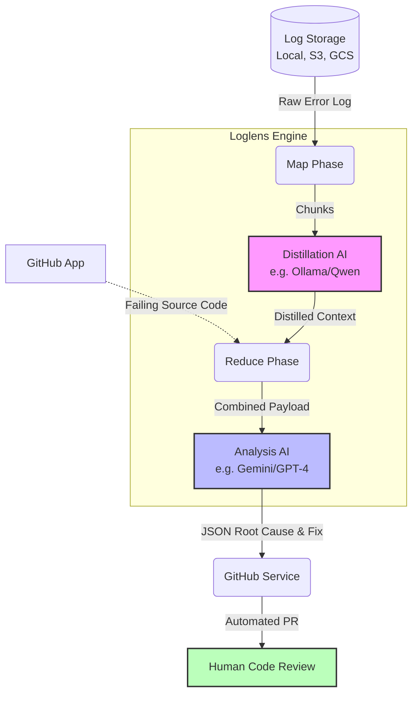

# Loglens

An AI-powered Information Density Optimizer CLI and API tool for analyzing massive system and application logs (starting with Apache Spark). 
It uses local LLMs (like Ollama or vLLM) for high-throughput chunk extraction and distillation, and premium LLMs (like Gemini) for root cause analysis—saving massive amounts of tokens while bypassing context window limits.

LogLens includes an automated remediation engine: it can read your GitHub repositories, find the source code linked to the failing job, generate a fix using the distilled logs, and natively open a Pull Request with the corrected code!

-- This repo is work in progress

---

## 🚀 Key Features

- **Map-Reduce Architecture**: Chunks massive log files and asks a local/cheap AI to distill the noise into signals. The final reduced signals are sent to a smarter AI to deliver a final diagnosis and code fix.
- **GitHub Auto-Remediation**: Natively connects to your codebases via GitHub Apps. It pulls your failing ETL scripts and auto-generates a Pull Request containing the AI's fixed code.
- **Server-Sent Events (SSE) API**: Includes a lightweight FastAPI server that streams the Map-Reduce log processing in real-time, preventing request timeouts on massive datasets.
- **Context Reduction Monitoring**: Calculates exact percentages showing how much log bloat was discarded (e.g. `20,000 chars -> 5,000 chars`) and injects these metrics directly into the automated Pull Request descriptions.
- **Provider Agnostic (LiteLLM)**: Fully integrated with `litellm`, allowing you to seamlessly swap between 100+ AI providers (Ollama, Gemini, OpenAI, Anthropic, Azure) with zero code changes.
- **Pluggable Storage Drivers**: Built to support reading logs from local files, with the architecture ready to be extended to S3, GCS, Azure Blob, HDFS, or any other cloud object store.
- **Human-in-the-Loop Safety**: While Sparklens completely automates the root cause analysis and raw code generation, it intentionally stops at the Pull Request phase. This guarantees that your team maintains full control over what is merged into production. The automated PR is explicitly tagged as bot-generated so reviewers can apply appropriate scrutiny.

---

## 🏗️ Architecture Flow



---

## 🛠️ Installation & Setup

1. **Clone and create a virtual environment:**
   ```bash
   python -m venv venv
   source venv/bin/activate  # On Windows: venv\Scripts\activate
   ```

2. **Install the package and dependencies:**
   ```bash
   pip install -e ".[dev]"
   ```

3. **Configure Environment Variables:**
   Copy the provided `.env.example` to `.env` (or create a new `.env`).
   ```env
   # AI Providers
   OLLAMA_HOST=http://localhost:11434
   GEMINI_API_KEY=your_gemini_api_key

   # GitHub App Integration (For automated PRs)
   GITHUB_APP_ID=123456
   GITHUB_INSTALLATION_ID=7891011
   GITHUB_APP_PRIVATE_KEY_PATH=/etc/secrets/github_app.pem
   ```

4. **Verify Installation:**
   ```bash
   python -m pytest tests/
   ```

---

## 💻 CLI Usage

Run the local CLI directly against a log file using the `loglens` command.

```bash
loglens /var/log/spark/spark.log --system spark --mode diagnosis
```

### Arguments
- `log_path`: The absolute or relative path to your `.log` file.
- `--system`: The target system of the log file. Default: `spark`.
- `--mode`: What the AI agent should do with the log.
  - `diagnosis` (default): Analyzes exceptions, stack traces, and tasks to find the root cause of a failure.
  - `utilization`: Analyzes cluster node data to determine if you are over-provisioned or under-utilized.
- `--github-repo` (Optional): Target repository to pull source code from (e.g. `nmundafale/demo-repo`).
- `--etl-file` (Optional): Specific file path in the repo to analyze and auto-fix (e.g. `src/job.py`).

---

## 🌐 API Usage (Real-Time Streaming)

Loglens ships with a built-in FastAPI server that supports Server-Sent Events (SSE) for real-time Map-Reduce pipeline visibility.

1. **Start the server:**
   ```bash
   loglens-server
   ```
   *(Runs on `http://0.0.0.0:8000`)*

2. **Invoke the Stream Endpoint (`POST /analyze/stream`):**
   ```bash
   curl -X POST -N "http://localhost:8000/analyze/stream" \
        -H "Content-Type: application/json" \
        -d '{
          "log_path": "/var/log/spark/oom_job.stderr",
          "storage_type": "local",
          "mode": "diagnosis",
          "github_repo": "nmundafale/loglens-demo-repo",
          "etl_file_path": "src/oom_job.py"
        }'
   ```
   *(Use the `-N` flag in cURL to stream the application JSON events iteratively).*

### Stream Output Example
```text
data: {"type": "status", "message": "--- Map Phase (Tier 1 | Concurrency: 1) ---"}
data: {"type": "status", "message": "Processing chunk 1/5..."}
data: {"type": "status", "message": "Processing chunk 2/5..."}
...
data: {"type": "status", "message": "--- Map Phase Complete in 120s. Context reduced by 85% ---"}
data: {"type": "status", "message": "Pushing Pull Request to nmundafale/loglens-demo-repo..."}
data: {"type": "status", "message": "Pull Request created successfully: https://github.com/..."}
data: {"type": "result", "analysis": "**Root Cause**: Massive cross-join OOM...", "github_pr_url": "..."}
```
